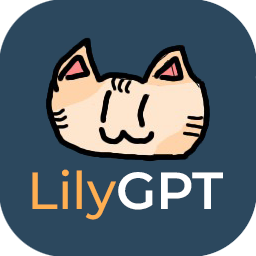

<div id="lilygpt" align="center">
  <a href="https://github.com/Zolice/LilyGPT">
    
  </a>

  <h3 align="center">LilyGPT</h3>

  <p align="center">
    A Discord Bot powered by ChatGPT
    <br />
    <a href="https://github.com/Zolice/LilyGPT">View Demo</a>
    ·
    <a href="https://github.com/Zolice/LilyGPT/issues">Report Bug</a>
    ·
    <a href="https://github.com/Zolice/LilyGPT/issues">Request Feature</a>
  </p>
</div>

<!-- TABLE OF CONTENTS -->
<details>
  <summary>Table of Contents</summary>
  <ol>
    <li>
      <a href="#about-the-project">About The Project</a>
      <ul>
        <li><a href="#built-with">Built With</a></li>
      </ul>
    </li>
    <li>
      <a href="#getting-started">Getting Started</a>
      <ul>
        <li><a href="#prerequisites">Prerequisites</a></li>
        <li><a href="#setting-up">Setting Up</a></li>
        <ul>
            <li><a href="#discord-bot-setup">Discord Bot Setup</a></li>
            <li><a href="#openai-setup">OpenAI Setup</a></li>
            <li><a href="#application-setup">Application Setup</a></li>
        </ul>
      </ul>
    </li>
    <li><a href="#usage">Usage</a></li>
    <li><a href="#roadmap">Roadmap</a></li>
    <li><a href="#license">License</a></li>
    <li><a href="#acknowledgments">Acknowledgments</a></li>
  </ol>
</details>

# About The Project
LilyGPT is a Discord Bot powered by ChatGPT

Using the OpenAI API, LilyGPT is able to generate text based on a prompt. The bot is able to generate text in a variety of different topics, such as names, descriptions, stories, etc. 

By using this bot, you can interact with ChatGPT directly through Discord, as a means of convenience and/or entertainment. 

## Built With


<p align="right"><a href="#lilygpt">back to top</a></p>

# Getting Started
## Prerequisites

* npm
  ```
  npm install
  ```

## Setting Up

### Discord Bot Setup
_If you already have a Discord Bot's Token and Discord Client ID, you can skip <a href="#application-setup">here</a>_

1. Open the <a href="https://discord.com/developers/applications">Discord Developer Portal</a> and log into your account
2. Click on the "New Application" button
3. Choose a name for the bot. We recommended the name LilyGPT!
4. Click on the "Bot" tab on the left side of the screen
5. Click on the "Add Bot" button and confirm
6. Click on the "Reset Token" button under the "Token" section and copy it somewhere safe. This is your Discord Bot's Token. <b>DO NOT SHARE THIS TOKEN</b>
7. Click on the "OAuth2" tab on the left side of the screen
8. Under the "Client information" section, copy the "Client ID". This is your Discord Client ID

#### OpenAI Setup
_If you already have an OpenAI Token, you can skip <a href="#application-setup">here</a>_
1. Open the <a href="https://platform.openai.com/account/api-keys">OpenAPI API Keys</a> page and login to your account
2. Click on the "Create new secret key" button
3. Copy the secret key, and do not lose it. <b>YOU WILL NOT BE ABLE TO SEE IT AGAIN</b>
4. pusheen

_Remember to set "Usage Limits" if you are on a paid plan, to prevent unexpected billing_


### Application Setup
1. If not done, <a href="#prerequisites">install the required packages using npm</a>
2. Rename the `.env.example` into `.env`
3. Update the `.env` file with your Discord Bot's Token, Discord Client ID and OpenAI Token accordingly
4. Register Discord Commands
    ```
    npm run registerCommands
    ```
5. Run the bot using the following command
   ```
   npm run start
   ```
6. Test the bot by typing `?Who are your creators` into any channel LilyGPT has access to.

<p align="right"><a href="#lilygpt">back to top</a></p>

# Usage
- Type a prompt for the bot, starting with `?`, such as ```?name a cat for me```

<p align="right"><a href="#lilygpt">back to top</a></p>

# Roadmap
- [x] Add OpenAI to the bot
- [x] Add commands to control the bot
- [x] Add support for multiple discord servers
- [x] Add Dall-E Support
- [x] Use TypeScript
- [ ] Use Embeds
- [x] Add LangChain
- [ ] Add Queue System

<p align="right"><a href="#lilygpt">back to top</a></p>

# License
Distributed under the MIT License. See `LICENSE.md` for more information.

<p align="right"><a href="#lilygpt">back to top</a></p>

# Acknowledgments
* [OpenAI](https://openai.com/)
* [Discord.js](https://discord.js.org/#/)

<p align="right"><a href="#lilygpt">back to top</a></p>
